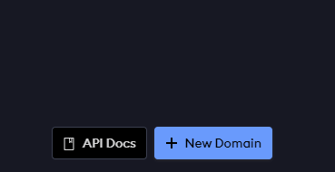
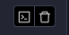
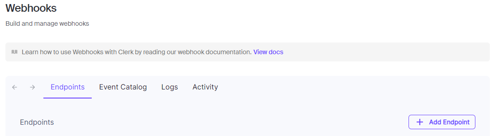
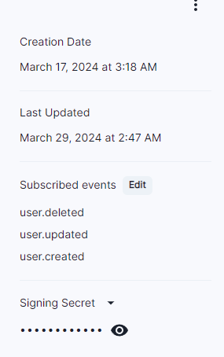
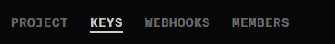
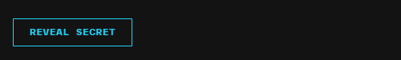

Il s'agit d'un projet full stack de type Twitch utilisant principalement Next.js 14, Livestreaming, React, Prisma, Stripe, Tailwind, MySQL.
Caractéristiques principales:
- 📡 Streaming via les protocoles RTMP/WHIP
- 🌐 Génération d'entrée
- 🔗 Connexion de l'application Next.js à OBS / Votre logiciel de streaming préféré
- 🔐 Authentification
- 📸 Téléchargement de vignettes
- 👀 Nombre de téléspectateurs en direct
- 🚦 Statuts en direct
- 💬 Chat en temps réel à l'aide de sockets
- 🎨 Couleur unique pour chaque spectateur dans le chat
- 👥 Système de suivi
- 🚫 Système de blocage
- 👢 Expulser les participants d'un flux en temps réel
- 🎛️ Tableau de bord Streamer / Créateur
- 🐢 Mode de discussion lente
- 🔒 Mode de chat pour les abonnés uniquement
- 📴 Activer / Désactiver le chat
- 🔽 Mise en page pliable (masquer les barres latérales, chat, etc., mode cinéma, etc.)
- 📚 Onglet Suivi et recommandations de la barre latérale
- 🏠 Page d'accueil recommandant des flux, triés par live en premier
- 🔍 Page de résultats de recherche avec une mise en page différente
- 🔄 Synchronisation des informations utilisateur avec notre base de données à l'aide de Webhooks
- 📡 Synchronisation des informations de statut en direct avec notre base de données à l'aide de Webhooks
- 🤝 Onglet Communauté
- 🎨 Beau design
- ⚡ Application ultra-rapide
- 📄 SSR (rendu côté serveur)
- 🗺️ Itinéraires et tracés groupés
- 🗃️ MySQL
- 🚀 Déploiement

### Conditions préalables
**Nœud version 18.17 ou ultérieure**

### Installer les packages

```shell
npm i
```

### Configurer le fichier .env

```js
NEXT_PUBLIC_CLERK_PUBLISHABLE_KEY=
CLERK_SECRET_KEY=
NEXT_PUBLIC_CLERK_SIGN_IN_URL=/sign-in
NEXT_PUBLIC_CLERK_SIGN_UP_URL=/sign-up
NEXT_PUBLIC_CLERK_AFTER_SIGN_IN_URL=/
NEXT_PUBLIC_CLERK_AFTER_SIGN_UP_URL=/
CLERK_WEBHOOK_SECRET=

DATABASE_URL=

LIVEKIT_API_URL=
LIVEKIT_API_KEY=
LIVEKIT_API_SECRET=
NEXT_PUBLIC_LIVEKIT_WS_URL=

```

### Tout d'abord il faut créer un domaine [Ngrok](https://dashboard.ngrok.com/cloud-edge/domains), apres avoir créer un compte, cliquer sur "Add new Domain"  et sur "Start a tunnel"  dans les commandes de Ngrok copier et coller la commande donnee en changeant a la fin le "80" par "3000".
### Vous aurez un lien qui va etre util apres (c'est aussi le lien du site crée)

### Pour les (NEXT_PUBLIC_CLERK_PUBLISHABLE_KEY et CLERK_SECRET_KEY), veuillez suivre les 2 premieres etapes de [la-documentation-de-clerk](https://clerk.com/docs/quickstarts/nextjs)

### Apres avoir créer un compte [Clerk](https://clerk.com/) cliquer sur "Webhooks" dans la barre latérale à gauche cliquer sur "Add Endpoint" .
### Mettez votre lien de Ngrok et ajouter à la fin de ce lien /api/webhooks/clerk.
### Cliquer sur le bouton en dessous de URL et vous devez voir à droite "Signing Secret"  ajouter ce code secret dans CLERK_WEBHOOK_SECRET.

### Pour le (DATABASE_URL) créer une base de données mySql et mettez votre lien sous forme de "mysql://le nom du host de la base de donnees (generalement root):le most de passe de la base de donnees@ le lien de la base de donnees(si elle locale elle est localhost):le port de la base de donnees(generalement 3306)/lenomdelabasededonnees"

### Apres avoir créer un compte [Livekit](https://livekit.io/) cliquer sur "Settings" dans la barre latérale à gauche, cliqueer sur "Keys"  ajouter un nouveau "Key".Copier le URL en dessous de "Websocket URL" et metter comme valeur de NEXT_PUBLIC_LIVEKIT_WS_URL. Et pour le "API Key" mettez le code comme valeur de LIVEKIT_API_KEY et pour le "Secret Key" mettez le comme valeur de LIVEKIT_API_SECRET si vous ne trouvez pas le "Secret Key" cliquer sur "Reveal Secret" . Cliquez sur Webhooks et sur "Add New Endpoint", choisissez un nom, pour le URL mettez le URL de votre sitee avec Ngrok et ajouter /api/webhooks/livekit et enfin en dessous de "Signing API Key" metter la cle de API que vous avez fait.


### Configurer Prisma
### Ajouter une base de données MySQL

```shell
npx prisma generate
npx prisma db push

```

### Démarrez l'application

```shell
npm run dev
```

## Commandes disponibles

Exécuter des commandes avec npm `npm run [command]`

| commande        | descriptif                                             |
| :---------------| :------------------------------------------------------|
| `dev`           | Démarre une instance de développement de l'application |
